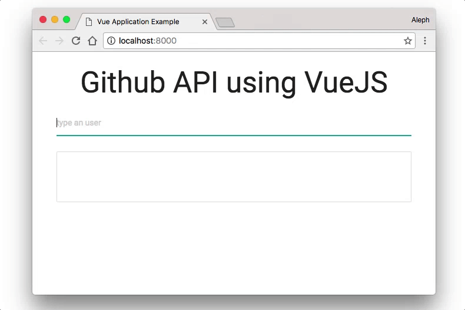

# Vue.js & Github API

# Description
This was me, as a back-end developer, trying to learn and keep up with all the fuzz that happens in front-end development.

# Usage
Open `index.html` et voilà. 

# Demo

